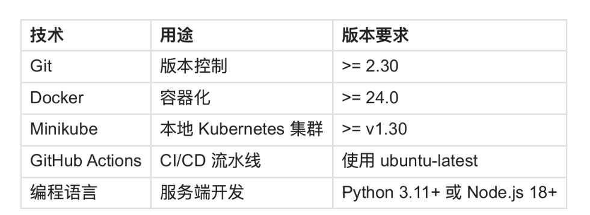

# task-manager-api
hainan~homework



@[TOC](目录)

# 一、本地开发环境搭建
## 1、git: Ubuntu 22.04 自带 (满足)
```ruby
git --version
git version 2.34.1
git config --global user.name "你的名字"
git config --global user.email "你的GitHub邮箱"
git checkout main
# 提交已有代码
git add .
git commit -m "chore: initial project setup"
git push -u origin main
```
安装所需的gitFlow
```shell
sudo apt install git-flow
# 在仓库里初始化：
git flow init
```
规划后续task所需的分支
```shell
git checkout develop
git merge main
git push -u origin develop

# task分支
git flow feature start health-check
git add .
git commit -m "feat(health): add health check endpoint"
git push -u origin feature/health-check

git checkout develop
git flow feature start task-crud
git add .
git commit -m "feat(task): add task data model and CRUD endpoints"
git push -u origin feature/task-crud
```

## 2、Docker：（version 29.8.0 满足）
### 2.1、运行以下命令卸载所有冲突的包：
```shell
sudo apt remove $(dpkg --get-selections docker.io docker-compose docker-compose-v2 docker-doc docker-buildx podman-docker containerd runc | cut -f1)
```
### 2.2、设置 Docker 的apt存储库。
```shell
# Add Docker's official GPG key:
sudo apt update
sudo apt install ca-certificates curl
sudo install -m 0755 -d /etc/apt/keyrings

# sudo curl -fsSL https://download.docker.com/linux/ubuntu/gpg -o /etc/apt/keyrings/docker.asc
# 国内可以选择以下的aliyun资源
sudo curl -fsSL https://mirrors.aliyun.com/docker-ce/linux/ubuntu/gpg -o /etc/apt/keyrings/docker.asc
sudo chmod a+r /etc/apt/keyrings/docker.asc

# Add the repository to Apt sources: 
sudo tee /etc/apt/sources.list.d/docker.sources <<LEO
Types: deb
URIs: https://mirrors.aliyun.com/docker-ce/linux/ubuntu
Suites: $(. /etc/os-release && echo "${UBUNTU_CODENAME:-$VERSION_CODENAME}")
Components: stable
Architectures: $(dpkg --print-architecture)
Signed-By: /etc/apt/keyrings/docker.asc
LEO

sudo apt update
```
### 2.3、安装 Docker 最新版软件包
```shell
sudo apt install docker-ce docker-ce-cli containerd.io docker-buildx-plugin docker-compose-plugin
```
### 2.4、验证 Docker 是否正在运行：
```shell
sudo systemctl status docker
```
### 2.5、让当前用户可以使用docker命令, 新的会话生效
```shell
sudo usermod -aG docker username
```
验证版本(满足)
```shell
 docker --version
Docker version 29.8.0, build 88096ef
```
### 2.6、如果你是国内的服务器可以添加一些三方源
```shell

sudo tee /etc/docker/daemon.json <<-'LEO'
{
  "registry-mirrors": [
    "https://docker.xuanyuan.me",
    "https://docker.1ms.run",
    "https://docker.m.daocloud.io"
  ]
}
LEO

sudo systemctl daemon-reload
sudo systemctl restart docker

# 验证是否生效
docker info | grep -A 5 "Registry Mirrors"
```


## 3、python: 安装所需版本的选择3.12 （满足）
### 1. 安装必要工具
```shell
sudo apt update
sudo apt install -y software-properties-common
```

### 2. 添加 deadsnakes PPA
```shell
sudo add-apt-repository ppa:deadsnakes/ppa -y
sudo apt update
```
### 3. 安装你想要的版本（以 3.12 为例）
```shell
sudo apt install -y python3.12 python3.12-venv python3.12-dev
```
### 4. 验证
```shell
python3.12 --version
Python 3.12.13
```
